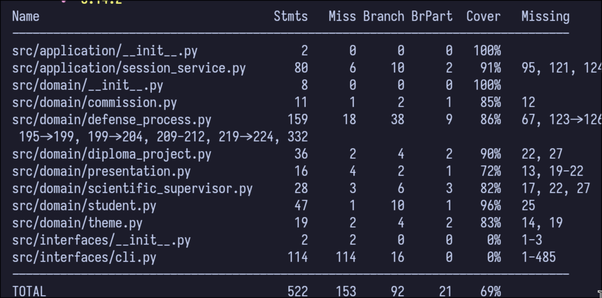
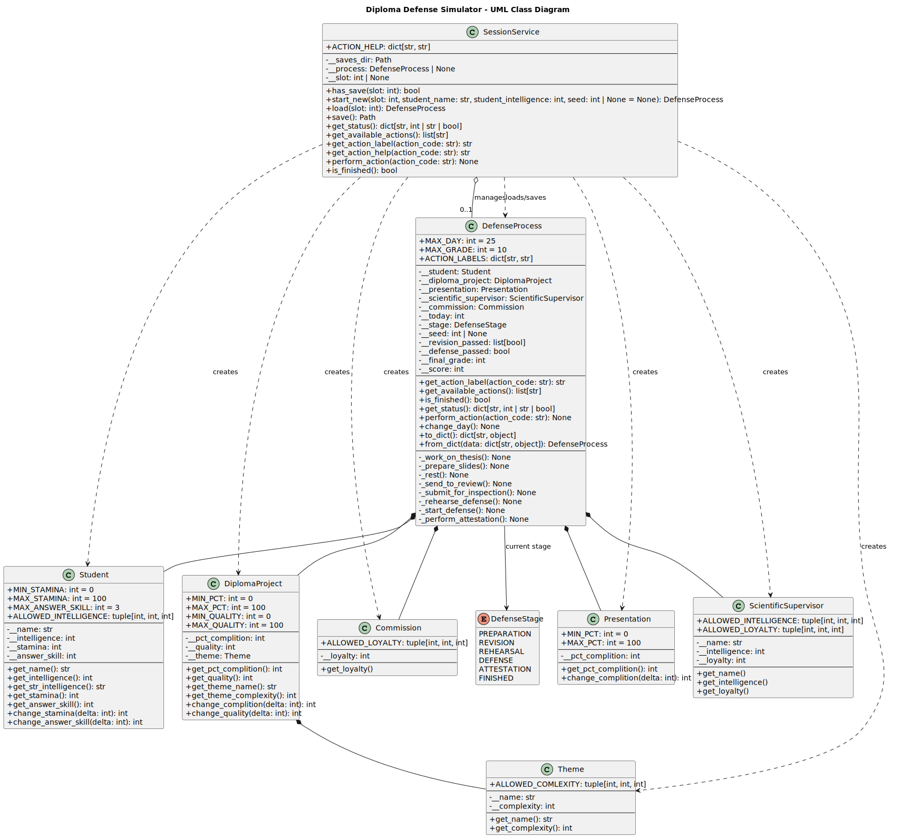

# ЛАБА 1. Модель подготовки к защите дипломного проекта


---
### Содержание


- [ЛАБА 1. Модель подготовки к защите дипломного проекта](#лаба-1-модель-подготовки-к-защите-дипломного-проекта)
    - [Содержание](#содержание)
  - [Условие лабораторной работы](#условие-лабораторной-работы)
    - [Цель](#цель)
    - [Задание](#задание)
    - [Вводные данные](#вводные-данные)
  - [Описание реализованной программы](#описание-реализованной-программы)
    - [Основные сущности](#основные-сущности)
    - [Этапы процесса](#этапы-процесса)
    - [Сохранения](#сохранения)
  - [Запуск](#запуск)
      - [Установка зависимостей](#установка-зависимостей)
      - [Стандартный запуск приложения](#стандартный-запуск-приложения)
      - [Полезные параметры](#полезные-параметры)
  - [Тесты](#тесты)
    - [Покрытие тестами](#покрытие-тестами)
  - [UML Диаграммы](#uml-диаграммы)

---

## Условие лабораторной работы

### Цель
- Изучить основные возможности языка Python для разработки программных систем с интерфейсом командной строки (CLI)
- Разработать программную систему на языке Python согласно описанию предметной области

### Задание
Шаги выполнения:
- выбрать/получить индивидуальный вариант задания
- провести объектно-ориентированный анализ предметной области, которая описана в варианте задания
- декомпозировать поведение системы на состояния, построить диаграмму состояний
- спроектировать классы с учетом принципов SOLID, построить диаграмму классов
- разработать программную систему на языке Python в соответствии с требованиями варианта задания и общими требованиями

Общие требования к выполнению:
- при написании кода использовать стандарт PEP8 и аннотацию типов
- использовать механизм исключений для обработки ошибочных ситуаций
- программная система должна быть разработана с интерфейсом командной строки (CLI)
- сохранять состояние программной системы между запусками программы
- задокументировать реализацию программной системы при помощи языка разметки markdown
- использовать UML версии 2.x для построения диаграммы классов и диаграммы состояний
- разработать unit-тесты
- исходники программы и документация (включая диаграммы) должны быть размещены на github


### Вводные данные
**Вариант: 70. Модель подготовки к защите дипломного проекта.**

`Предметная область:` завершающий этап образования, защита выпускной работы.

`Важные сущности:` дипломный проект, студент, научный руководитель, комиссия, презентация.

`Операции:` операция подготовки презентации и доклада, операция рецензирования и корректировки работы, операция проведения репетиций защиты, операция ответов на вопросы комиссии, операция аттестации и выставления оценок.

## Описание реализованной программы

CLI-симулятор моделирует процесс подготовки студента к защите диплома по дням с учетом:
- выбранных действий на каждом шаге;
- текущего этапа подготовки;
- характеристик студента;
- прогресса диплома и презентации;
- промежуточных ревизий и финальной аттестации;
- а также скрытых параметров (например лояльность нучного руководителя и комиссии)

### Основные сущности
- `Student` — имя, интеллект, выносливость, навык ответов.
- `DiplomaProject` — процент готовности, качество, тема.
- `Presentation` — готовность презентации.
- `ScientificSupervisor` — интеллект и лояльность руководителя.
- `Commission` — лояльность комиссии.
- `DefenseProcess` — доменная логика этапов, дней, действий и расчета итогов.
- `SessionService` — фасад приложения: старт новой сессии, загрузка, сохранение, выполнение действия.

### Этапы процесса
- `Preparation`
- `Revision`
- `Rehearsal`
- `Defense`
- `Attestation`
- `Finished`

### Сохранения
- Сессии сохраняются в `saves/slot_<N>.json`.
- При старте без `--new` из выбранного слота выполняется загрузка сохранения.

## Запуск

#### Установка зависимостей
```bash
cd lab1
uv sync
```

#### Стандартный запуск приложения
```bash
uv run python main.py 
```

#### Полезные параметры
- `--slot` — номер слота сохранения (`>= 1`)
- `--new` — начать новую сессию в выбранном слоте
- `--seed` — seed генератора случайных значений

## Тесты

Запуск всех unit-тестов:
```bash
cd lab1
uv run python -m unittest discover -s tests -v
```

### Покрытие тестами

Установка dev-зависимостей (если еще не установлены):
```bash
cd lab1
uv sync --group dev
```

Запуск тестов с coverage:
```bash
uv run coverage run --source=src --branch -m unittest discover -s tests -v
uv run coverage report -m
```




## UML Диаграммы
- Диаграмма классов (исходник): `docs/uml/class-diagram.puml`
- Диаграмма классов (SVG): `images/class-diagram.svg`
- Диаграмма состояний (исходник): `docs/uml/state-diagram.puml`
- Диаграмма состояний (SVG): `images/state-diagram.svg`

Встроенный просмотр:



